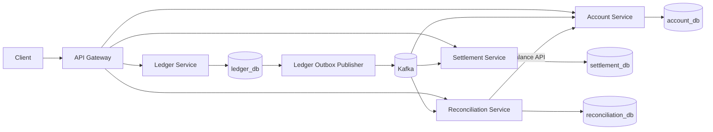

# Aven

Aven is a distributed ledger and settlement platform built with Java 21, Spring Boot, PostgreSQL, and Kafka. It models the internal financial infrastructure a fintech company uses to record money movement, project balances, settle transactions asynchronously, and detect inconsistencies.

The central design rule is simple:

> The immutable double-entry ledger is the source of truth. Every balance and workflow state outside it is derived and independently verifiable.

Aven is a backend/infrastructure project. It intentionally has no UI and no real payment-rail integration; the focus is correctness under duplicate delivery, partial failure, asynchronous processing, and recovery.

## Architecture



| Component | Port | Responsibility |
| --- | ---: | --- |
| API Gateway | 8080 | Routes external requests and propagates `X-Correlation-ID`. |
| Ledger Service | 8081 | Records balanced immutable transactions, reversals, entry history, and outbox events. |
| Account Service | 8082 | Owns account lifecycle and maintains an idempotent derived balance cache. |
| Settlement Service | 8083 | Batches transactions, simulates settlement, retries failures, and dead-letters exhausted work. |
| Reconciliation Service | 8084 | Independently replays ledger events, compares balances, and records drift. |
| Kafka | 9092 | Carries versioned domain events between independent consumer groups. |

Every stateful service owns a separate PostgreSQL database. Services never query another service's database directly.

## What the project demonstrates

- Immutable double-entry accounting
- Atomic financial writes with PostgreSQL transactions
- Request idempotency using `Idempotency-Key`
- PostgreSQL advisory locks for concurrent idempotent requests
- Compensating reversal transactions instead of mutation
- Transactional outbox publishing
- At-least-once Kafka delivery with idempotent consumers
- Database-per-service ownership
- Choreographed asynchronous workflows
- Exponential settlement retry and business DLQ handling
- Independent event replay and reconciliation
- Correlation-ID propagation across HTTP and Kafka
- Flyway-controlled schema migrations
- Testcontainers integration with real PostgreSQL

## End-to-end transaction flow

1. A client creates two accounts through Gateway.
2. The client posts a balanced transaction with an idempotency key.
3. Ledger validates that signed debits and credits sum to zero.
4. Ledger saves the transaction, entries, and a JSON outbox event in one PostgreSQL transaction.
5. A scheduled publisher sends the event to Kafka and marks the outbox row published only after acknowledgement.
6. Account consumes the event and updates cached balances in the same local transaction as its `processed_events` marker.
7. Settlement consumes the event and creates one pending settlement item.
8. The settlement scheduler attempts the item, applies exponential backoff on failure, and emits success or exhausted-failure events through its own outbox.
9. Reconciliation consumes the original ledger event in an independent group and recomputes balances.
10. Reconciliation periodically compares its result with Account Service and persists/emits a drift finding if they disagree.

## Correctness model

### Double-entry invariant

Amounts are positive `NUMERIC(19,4)` values with an explicit direction. Aven uses this internal sign convention:

- `DEBIT` contributes a positive value.
- `CREDIT` contributes a negative value.

A transaction is accepted only when the signed sum is zero. `BigDecimal` is used throughout; money is never represented with binary floating point.

### Immutable corrections

Recorded entries are never edited or deleted. Reversing a transaction creates a new transaction with inverted directions and a reference to the original. A unique database constraint and advisory lock allow one reversal while leaving the original untouched.

### HTTP idempotency

`POST /transactions` and reversal requests require `Idempotency-Key`. Ledger takes a transaction-scoped PostgreSQL advisory lock derived from the key, checks for an existing result, and returns it for a retry. The unique database constraint remains defense in depth.

### Transactional outbox

Writing PostgreSQL and publishing Kafka as separate request steps creates a dual-write failure window. Aven instead writes the domain state and publication intent in one local database transaction. Pollers publish pending rows later.

Outbox delivery is at-least-once, not exactly-once. A crash after Kafka acknowledgement but before `published_at` commits can publish a duplicate, so every consumer records the envelope's `eventId` in `processed_events` alongside its state update.

## Kafka contracts

Shared event records live in `common-events`; the module contains no Spring application or database.

| Topic | Producer | Purpose |
| --- | --- | --- |
| `ledger.transaction-created.v1` | Ledger | Full immutable transaction entries for projections and settlement. |
| `settlement.transaction-settled.v1` | Settlement | Successful settlement fact. |
| `settlement.transaction-failed.v1` | Settlement | Permanently failed settlement fact. |
| `settlement.transaction-created.dlq.v1` | Settlement | Exhausted work requiring operational inspection. |
| `reconciliation.drift-detected.v1` | Reconciliation | Balance discrepancy fact. |

Account, Settlement, and Reconciliation use separate consumer groups, so each receives every ledger transaction independently.

## Repository layout

```text
aven/
├── common-events/          Shared versioned event contracts
├── services/
│   ├── ledger/             Source-of-truth financial writes
│   ├── account/            Account lifecycle and balance projection
│   ├── settlement/         Batch/retry/DLQ workflow
│   ├── reconciliation/     Independent replay and drift detection
│   └── gateway/            HTTP routing and correlation IDs
├── docker-compose.yml      Kafka, PostgreSQL, and service topology
├── Makefile                Local lifecycle commands
└── pom.xml                 Multi-module Maven reactor
```

Each service follows a small layered structure where applicable:

```text
api -> application -> domain <- repository
          ^              ^
          |              |
       messaging --------+
```

Controllers and listeners are adapters. Application services own use cases and transaction boundaries. Domain classes own state transitions. Repositories isolate persistence.

## Requirements

- Docker with Compose v2
- Java 21 for running Maven outside containers
- Bash for Make targets

## Start the platform

```bash
make up
```

This builds and starts:

- Kafka in single-node KRaft mode
- A one-shot explicit topic-initialization container
- Four isolated PostgreSQL 16 containers
- All five Spring Boot services

Inspect status and logs:

```bash
make ps
make logs
```

Health endpoint:

```bash
curl http://localhost:8080/actuator/health
```

Stop the stack and delete its local volumes:

```bash
make down
```

`make down` removes database and Kafka volumes. Use plain `docker compose down` if you want to retain local data.

## API walkthrough

### Create accounts

```bash
curl -X POST http://localhost:8080/accounts \
  -H 'Content-Type: application/json' \
  -d '{"ownerRef":"alice"}'

curl -X POST http://localhost:8080/accounts \
  -H 'Content-Type: application/json' \
  -d '{"ownerRef":"bob"}'
```

Copy the returned account UUIDs for the following requests.

### Record a balanced transaction

```bash
curl -X POST http://localhost:8080/transactions \
  -H 'Content-Type: application/json' \
  -H 'Idempotency-Key: transfer-001' \
  -H 'X-Correlation-ID: readme-demo' \
  -d '{
    "entries": [
      {"accountId":"<alice-id>","amount":100.0000,"direction":"DEBIT"},
      {"accountId":"<bob-id>","amount":100.0000,"direction":"CREDIT"}
    ]
  }'
```

Repeat the same request with `transfer-001`; Ledger returns the original transaction instead of creating another.

### Read balances and entry history

```bash
curl http://localhost:8080/accounts/<alice-id>/balance
curl 'http://localhost:8080/accounts/<alice-id>/entries?page=0&size=20'
```

Balances are eventually consistent and may briefly lag the accepted Ledger response.

### Read settlement status

```bash
curl http://localhost:8080/settlements/<transaction-id>
```

### Reverse a transaction

```bash
curl -X POST http://localhost:8080/transactions/<transaction-id>/reverse \
  -H 'Idempotency-Key: reversal-001'
```

### Trigger and inspect reconciliation

```bash
curl -X POST http://localhost:8080/reconciliation/run
curl http://localhost:8080/reconciliation/drifts
```

## Account lifecycle API

```bash
curl -X PATCH http://localhost:8080/accounts/<account-id>/status \
  -H 'Content-Type: application/json' \
  -d '{"status":"FROZEN"}'
```

Supported states are `ACTIVE`, `FROZEN`, and terminal `CLOSED`.

## Configuration

All services use environment-based configuration with localhost defaults. Important settings include:

- service-specific database URL, username, and password
- `KAFKA_BOOTSTRAP_SERVERS`
- `SERVER_PORT`
- `AVEN_SETTLEMENT_FAILURE_RATE`
- `AVEN_SETTLEMENT_BATCH_SIZE`
- `AVEN_SETTLEMENT_MAX_ATTEMPTS`
- `AVEN_SETTLEMENT_INITIAL_BACKOFF_MS`
- `ACCOUNT_SERVICE_URL`

Flyway is the schema authority. Hibernate runs with `ddl-auto=validate`, so application startup checks mappings but does not mutate database structure.

## Tests

Run the complete Maven reactor:

```bash
make test
```

The suite includes fast domain tests, a Gateway context test, and a real PostgreSQL Ledger integration test using Testcontainers. The Testcontainers test is reported as skipped when Docker is unavailable.

Build without executing tests:

```bash
MAVEN_USER_HOME=$PWD/.m2 services/ledger/mvnw -f pom.xml package -DskipTests
```

## Failure behavior

| Failure | Expected behavior |
| --- | --- |
| Ledger crashes before database commit | No transaction or event is committed; client retries the same key. |
| Kafka is unavailable | Ledger remains durable; outbox rows wait for recovery. |
| Consumer dies after database commit | Kafka may redeliver; `processed_events` prevents a second state change. |
| Settlement provider fails transiently | Item enters `RETRY_PENDING` with exponential backoff. |
| Settlement exhausts attempts | Item becomes `FAILED`; failure and DLQ events are written through the outbox. |
| Account projection drifts | Reconciliation records and emits a specific discrepancy. |

## Current status

The core services, migrations, event contracts, reliability patterns, unit tests, and PostgreSQL integration test are implemented. The Maven reactor packages successfully and the Compose model validates.

Before using this as a live interview demo, run and verify the full Compose stack on a Docker-enabled machine and complete a scripted failure/recovery walkthrough. The current development environment did not permit access to the Docker socket, so container startup has not been proven here.

## Deliberate v1 boundaries

- No UI
- No real ACH/card/payment provider
- No multi-currency or FX
- No production authentication/authorization
- No horizontal-scale/load target
- No claim that Kafka/PostgreSQL produce end-to-end exactly-once delivery

The next production-hardening steps would add worker row leasing, structured metrics/logging, transport poison-message DLQs, HTTP resilience, schema-registry enforcement, security, and broader Kafka/PostgreSQL integration tests.
